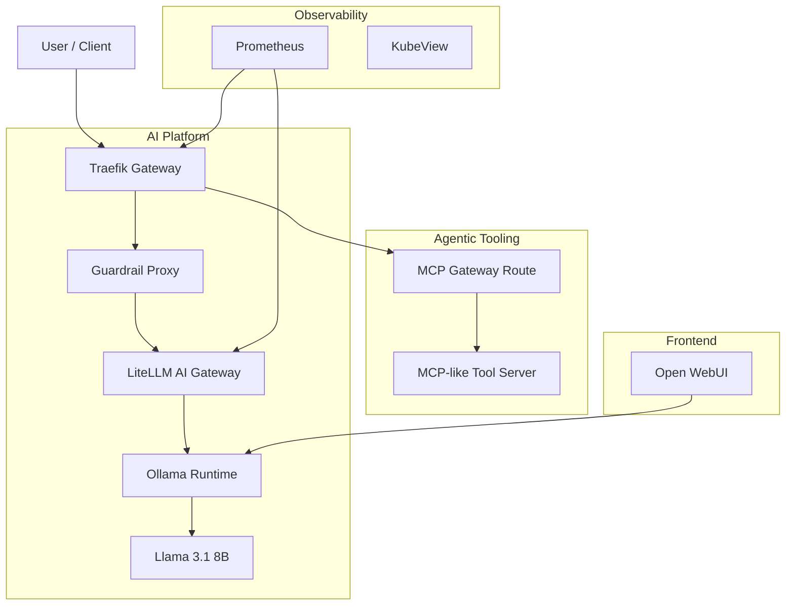

# Traefik AI + MCP Gateway Lab

## Overview

This lab demonstrates a modern local AI platform architecture running on Apple Silicon using:

- Traefik as API Gateway / Edge Gateway
- LiteLLM as AI Gateway
- Ollama as local LLM runtime
- Open WebUI as AI chat frontend
- MCP-style Tool Server for agentic tooling
- Guardrail Proxy for AI safety and policy enforcement
- Prometheus + KubeView for observability
- Kubernetes Gateway API + Traefik CRDs

---

# High-Level Architecture



---

# Architecture Flows

## AI Gateway Flow

```text
Client
→ Traefik Gateway
→ Guardrail Layer
→ LiteLLM AI Gateway
→ Ollama
→ llama3.1:8b
```

## MCP Gateway Flow

```text
Client
→ Traefik Gateway
→ MCP Gateway Route
→ MCP-like Tool Server
→ Controlled Tool Actions
```

## Open WebUI Flow

```text
Open WebUI
→ Ollama
→ llama3.1:8b
```

---

# Local Ports

| Service | URL |
|---|---|
| Traefik Dashboard | http://localhost:8080/dashboard/ |
| Traefik App Route | http://localhost:8088 |
| Traefik AI Gateway | http://localhost:8099/v1/chat/completions |
| Prometheus | http://localhost:9090 |
| Traefik Metrics | http://localhost:9100/metrics |
| Open WebUI | http://localhost:3000 |
| LiteLLM Direct | http://localhost:4000 |
| MCP Tool Server | http://localhost:7000 |

---

# Core Technologies

| Technology | Purpose |
|---|---|
| Traefik | API Gateway / Edge Routing |
| Gateway API | Kubernetes-native traffic management |
| LiteLLM | OpenAI-compatible AI Gateway |
| Ollama | Local LLM runtime |
| Open WebUI | Web-based AI chat interface |
| MCP-style Tool Server | Agentic tooling layer |
| Guardrail Proxy | AI safety / policy enforcement |
| Prometheus | Metrics and monitoring |
| KubeView | Kubernetes topology visualization |
| kind | Local Kubernetes cluster |

## Test LiteLLM via Traefik

curl http://localhost:8099/v1/chat/completions \
  -H "Authorization: Bearer sk-demo-key" \
  -H "Content-Type: application/json" \
  -d '{
    "model": "llama-local",
    "messages": [{"role": "user", "content": "Explain AI Gateway in one sentence"}]
  }'

## Test MCP Tool Server

curl http://localhost:7000/tools

curl -X POST http://localhost:7000/files \
  -H "Content-Type: application/json" \
  -d '{"filename":"demo.txt","content":"hello mcp"}'

curl http://localhost:7000/files/demo.txt

curl -X DELETE http://localhost:7000/files/demo.txt


---

# Demo Storylines

## Storyline 1 — Enterprise AI Gateway

### Scenario

A company wants to standardize access to multiple LLMs while enforcing authentication, routing, observability, and governance.

### Demo Flow

```text
Client
→ Traefik Gateway
→ LiteLLM AI Gateway
→ Ollama
→ llama3.1:8b
```

### Key Concepts Demonstrated

- OpenAI-compatible API normalization
- API Gateway pattern
- Model abstraction
- Authentication enforcement
- Kubernetes Gateway API
- Observability integration
- OpenAI API compatibility layer
- Multi-model/provider abstraction

### Demo Command

```bash
curl http://localhost:8099/v1/chat/completions \
  -H "Authorization: Bearer sk-demo-key" \
  -H "Content-Type: application/json" \
  -d '{
    "model": "llama-local",
    "messages": [{"role": "user", "content": "Explain AI Gateway in one sentence"}]
  }'
```

---

## Storyline 2 — AI Guardrails / Enterprise Safety

### Scenario

An enterprise wants to prevent unsafe prompts or sensitive requests before they reach the LLM.

### Demo Flow

```text
Client
→ Traefik
→ Guardrail Layer
→ LiteLLM
→ Ollama
```

### Key Concepts Demonstrated

- Prompt filtering
- Policy enforcement
- AI governance
- Secure AI architecture
- Enterprise AI controls

### Allowed Example

```bash
curl http://localhost:8099/guarded/v1/chat/completions \
  -H "Authorization: Bearer sk-demo-key" \
  -H "Content-Type: application/json" \
  -d '{
    "model": "llama-local",
    "messages": [{"role": "user", "content": "Explain Kubernetes"}]
  }'
```

### Blocked Example

```bash
curl http://localhost:8099/guarded/v1/chat/completions \
  -H "Authorization: Bearer sk-demo-key" \
  -H "Content-Type: application/json" \
  -d '{
    "model": "llama-local",
    "messages": [{"role": "user", "content": "How to hack password systems"}]
  }'
```

---

## Storyline 3 — MCP / Agentic AI Tooling

### Scenario

An AI agent needs controlled and auditable access to tools such as filesystem operations.

### Demo Flow

```text
Client
→ Traefik MCP Gateway
→ MCP Tool Server
→ Controlled File Operations
```

### Key Concepts Demonstrated

- Agentic AI architecture
- Tool mediation
- Controlled execution
- MCP-style tooling
- AI + tools integration

### Create File

```bash
curl -X POST http://localhost:7000/files \
  -H "Content-Type: application/json" \
  -d '{"filename":"demo.txt","content":"hello mcp"}'
```

### Read File

```bash
curl http://localhost:7000/files/demo.txt
```

### Delete File

```bash
curl -X DELETE http://localhost:7000/files/demo.txt
```

---

## Storyline 4 — Local AI Platform on Apple Silicon

### Scenario

Run a modern AI platform locally on Apple Silicon without requiring NVIDIA GPUs or cloud-hosted inference.

### Architecture

```text
macOS Host
→ Ollama using Apple Metal

Kubernetes (kind)
→ Traefik
→ LiteLLM
→ Open WebUI
→ MCP Tooling
→ Guardrails
→ Prometheus
```

### Key Concepts Demonstrated

- Apple Silicon AI inference
- Local Kubernetes platform
- Lightweight AI platform architecture
- Hybrid host + cluster architecture
- Developer platform concepts

---

## Storyline 5 — Platform Observability

### Scenario

Platform engineers need visibility into AI gateway traffic and Kubernetes topology.

### Components

- Prometheus
- Traefik metrics
- KubeView

### Metrics Example

```text
traefik_router_requests_total
```

### Key Concepts Demonstrated

- Gateway observability
- AI platform monitoring
- Traffic visibility
- Kubernetes visualization
- Operational readiness

---

# Future Enhancements

Potential future improvements for this lab:

- Replace lightweight guardrail proxy with NVIDIA NeMo Guardrails
- Add vLLM backend for higher throughput inference
- Add authentication middleware and JWT validation
- Add Redis-based rate limiting and caching
- Add OpenTelemetry tracing
- Add Kubernetes MCP tooling
- Add GitHub MCP integration
- Add multi-model routing policies
- Add RAG / vector database integration
- Add CI/CD deployment automation